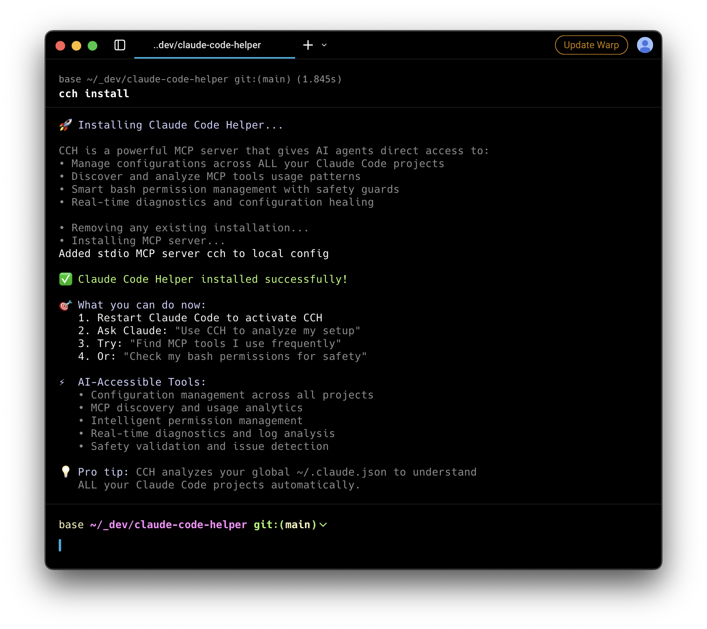

# Claude Code Helper (CCH)

<div align="center">
  
  <p><em>Swiss Army knife for Claude Code configuration management</em></p>
</div>

**A versatile CLI-first tool that can be used as either a CLI or MCP server for swift management of your Claude configuration file.**

Tell Claude to run `cch` commands directly - it just works! Every command is **dry-run by default** for safety.

## 🎯 Why CCH?

**🔧 CLI-First Design**: Simple commands that Claude can run directly. No MCP complexity required - just `cch clean` and you're done.

**🛡️ Dry-Run by Default**: Every cleanup command shows you what will happen BEFORE making changes. Use `--execute` when ready.

**🧹 Smart Cleanup**: Reduced configs from 14MB to 84KB (99.4% reduction). Focuses on removing images and large pastes intelligently.

**🚨 Always-On Security**: Automatic secret detection on EVERY command with immediate one-command remediation.

**📊 Config Intelligence**: Analyzes your entire Claude Code workspace, discovering patterns and suggesting optimizations.

## 🚀 Quick Start

```bash
# Install globally
npm install -g @light-merlin-dark/claude-code-helper

# Clean your bloated config (dry-run by default!)
cch clean                  # Preview what will be removed
cch clean --execute        # Actually perform cleanup

# Remove empty projects
cch clean projects         # Preview first
cch clean projects -e      # Then execute

# Nuclear option - clear all history
cch clean history          # See what would be cleared
cch clean history -e       # Execute if needed
```

## Key Features

**✨ Unified Clean Command**: Smart, modular cleanup system
- `cch clean` - Remove large pastes, images, dangerous permissions
- `cch clean projects` - Remove empty or accidental projects  
- `cch clean history` - Clear all conversation history
- Always shows preview first, requires `--execute` to run

**🤖 Works Both Ways**: Use as CLI or MCP
- **CLI Mode**: Tell Claude to run `cch` commands directly
- **MCP Mode**: Install as MCP server for advanced integrations
- Most users only need the CLI - MCP is optional!

## 📦 Installation

```bash
# Install globally
npm install -g @light-merlin-dark/claude-code-helper

# That's it! Start using CLI commands immediately
cch clean              # Preview config cleanup
cch --audit            # Analyze configuration
```

## 🎮 CLI Usage (Recommended)

Just tell Claude to run these commands - no MCP setup needed!

### Essential Commands

```bash
# Clean Commands (all dry-run by default!)
cch clean              # Smart cleanup - removes images, large pastes
cch clean projects     # Remove empty/accidental projects
cch clean history      # Clear all conversation history
cch clean help         # See all options

# Always add --execute or -e to actually run:
cch clean -e           # Execute after preview

# Security & Health
cch --audit            # Full config analysis with secret detection
cch --mask-secrets-now # Emergency secret masking

# Permission Management  
cch -lp                # List current permissions
cch -add "docker"      # Add permission (auto-expands to docker:*)
cch -ap                # Apply permissions to all projects
```

### Why CLI First?

- **Simple**: Claude runs commands directly - no complex setup
- **Safe**: Every command previews changes before making them
- **Fast**: Instant results without MCP overhead
- **Clear**: See exactly what will happen before it does

## 🔌 Optional: MCP Setup (Advanced)

For power users who want MCP integration:

```bash
cch install            # Install as MCP server in Claude Code
```

### Available MCP Tools

#### Core Management Tools
- `reload-mcp` - Reload MCP configurations from Claude CLI
  - Reload specific MCP by name
  - Reload all MCPs with `all: true`
  - Real-time status updates

- `doctor` - Run comprehensive diagnostics and health checks
  - System configuration analysis
  - Global Claude config analysis (~/.claude.json)
  - Permission safety validation
  - MCP connectivity tests
  - Actionable recommendations

- `view-logs` - View Claude Code Helper logs with filtering
  - Filter by log level (ERROR, WARN, INFO, DEBUG)
  - Search for specific text
  - View logs from specific dates
  - Control number of lines returned

- `backup` - Create configuration backups
  - Compressed backups with automatic naming
  - Optional custom backup names
  - Safe storage in ~/.cch/backups/

- `restore` - Restore from configuration backups
  - List available backups
  - Restore from specific backup by name
  - Automatic backup before restore

- `list-projects` - Show all projects in configuration
  - Extract project tree from audit output
  - Project statistics and details
  - Configuration overview

#### MCP Discovery Tools (Global Config Aware)
- `discover-mcp-tools` - Discover MCP tools used across ALL your projects
  - Reads from global Claude config (~/.claude.json)
  - Find tools used in multiple projects
  - Get usage statistics and frequency
  - Project association details
  - Optional detailed statistics

- `list-mcps` - List all MCPs found across your entire workspace
  - Analyzes global Claude config for all projects
  - Usage count per MCP
  - Project associations
  - Tool listings per MCP
  - Sort by usage frequency

- `get-mcp-stats` - Get comprehensive MCP usage statistics
  - Aggregates data from global config
  - Total MCPs, tools, and usage counts
  - Top MCPs and tools by usage
  - Group by MCP, tool, or project
  - Cross-project analysis

#### Configuration Management Tools
- `audit` - Comprehensive configuration analysis
  - Security analysis with dangerous permission detection
  - Automatic secret detection and reporting
  - Configuration bloat detection
  - Project overview with tree structure
  - Actionable recommendations

- `clean-history` - Remove large pastes from conversation history
  - Identify bloated project configurations
  - Preview changes before applying
  - Automatic backup before cleaning

- `clean-dangerous` - Remove dangerous permissions
  - Detect and remove risky permissions
  - Safety-first approach to permission management

#### Bulk Operations Tools
- `add-permission` - Add permissions to multiple projects
  - Pattern matching for project selection
  - Bulk operations across project sets
  - Dry-run preview mode

- `remove-permission` - Remove permissions from multiple projects
  - Target dangerous permissions specifically
  - Pattern-based project selection
  - Safety confirmations

- `add-tool` - Add MCP tools to multiple projects
  - Bulk MCP tool management
  - Project pattern matching

- `remove-tool` - Remove MCP tools from multiple projects
  - Clean up unused MCP tools
  - Bulk removal operations

### MCP Usage Examples

Ask Claude to help with your setup:

```
"Use CCH to reload the aia MCP"
"Run diagnostics on my Claude Code setup"
"Show me error logs from the last hour"
"Find MCP tools I use frequently"
"Give me statistics about my MCP usage"
"Check my bash permissions for safety issues"
"Audit my Claude Code configuration for issues"
"Create a backup before making changes"
"Clean up dangerous permissions across all projects"
```

## 🛡️ Safety Features

- **Always-On Secret Detection**: Automatic scanning on EVERY command execution
- **Dry-Run by Default**: All clean commands preview before changing anything
- **Emergency Response**: `cch --mask-secrets-now` for immediate secret remediation
- **Blocked Commands**: Prevents `rm -rf /`, fork bombs, disk formatting
- **Automatic Backups**: Creates backups before any changes
- **Smart Expansion**: `docker` → `docker:*` automatically

## 📊 Advanced Features

### Permission Management
- Discover frequently used permissions across projects
- Apply permissions to multiple projects with patterns
- Smart command expansion (`docker` → `docker:*`)
- Bulk operations with dry-run previews

### Configuration Analysis
- MCP tool frequency analysis across all projects
- Permission usage patterns and recommendations
- Configuration health monitoring with `--audit`
- Cross-project statistics and insights

### Backup & Recovery
```bash
cch -bc --name pre-update  # Create backup before changes
cch -rc --name pre-update  # Restore from backup
cch --config               # View current configuration
```

### Command Reference

| Command | Alias | Description |
|---------|-------|-------------|
| `--audit` | - | Comprehensive security & config analysis |
| `--mask-secrets-now` | - | 🚨 Emergency secret masking (force mode) |
| `--clean-config` | - | Interactive config cleanup |
| `--list-permissions` | `-lp` | List your permissions |
| `--add-permission` | `-add` | Add permission with smart expansion |
| `--discover` | `-dp` | Discover frequently used permissions |
| `--discover-mcp` | `-dmc` | Discover frequently used MCP tools |
| `--reload-mcp` | `-rmc` | Reload MCP configurations |
| `--apply-permissions` | `-ap` | Apply permissions to all projects |
| `--backup-config` | `-bc` | Create backup |
| `--restore-config` | `-rc` | Restore from backup |
| `--doctor` | - | Run diagnostics |
| `--config` | `-c` | View configuration |

## 🎯 How It Works

**Dual Interface**: MCP server for AI agents + CLI for manual control, sharing the same core functionality.

**Always-On Security**: Every command execution includes automatic secret detection with immediate remediation options.

**Smart Permissions**: Stored in `~/.cch/permissions.json` with automatic expansion (`docker` → `docker:*`) and safety validation.

**Global Analysis**: Reads `~/.claude.json` to analyze all your projects at once, not just individual directories.

**Safety First**: Automatic backups, dangerous command blocking, secret masking, and detailed change tracking for all operations.

## 🔧 Development

```bash
# Clone and setup
git clone https://github.com/light-merlin-dark/claude-code-helper.git
cd claude-code-helper
npm install

# Development workflow
npm run dev         # Run in development mode
npm run build       # Build for production
npm run lint        # Type checking

# Testing with Bun
bun test            # Run all tests
bun test:unit       # Unit tests only
bun test:e2e        # End-to-end tests only
bun test:watch      # Watch mode
```

### Testing Infrastructure

Comprehensive test coverage including:
- Unit tests for services and components
- Integration tests for workflows
- End-to-end CLI command tests
- MCP protocol validation tests
- Performance benchmarks
- Error scenario coverage

## 📁 Configuration Files

```
~/.claude.json         # Claude's main config (managed by Claude)
~/.cch/                # CCH configuration directory
  ├── permissions.json # Your base permissions
  ├── preferences.json # User preferences
  ├── state.json       # Usage tracking
  └── backups/         # Configuration backups
```

## Default Permissions

Safe defaults when starting fresh:
- `make:*` - Make commands
- `npm run:*` - NPM scripts
- `npm test:*` - NPM tests
- `git status` - Git status
- `git diff:*` - Git diffs
- `git log:*` - Git logs

## License

MIT License - see [LICENSE](LICENSE) file for details.

## Contributing

Contributions are welcome! Please feel free to submit a Pull Request.

---

Built with ❤️ by [@EnchantedRobot](https://twitter.com/EnchantedRobot)
